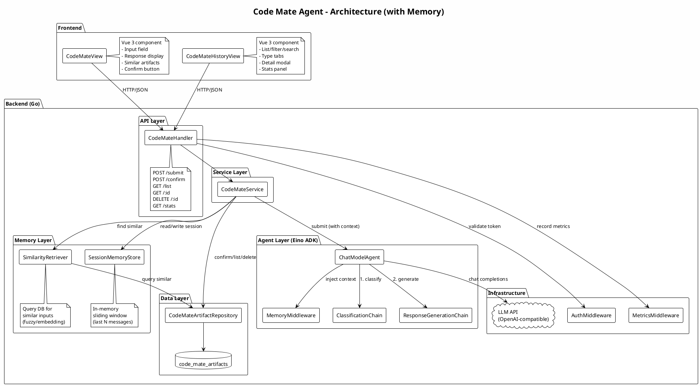
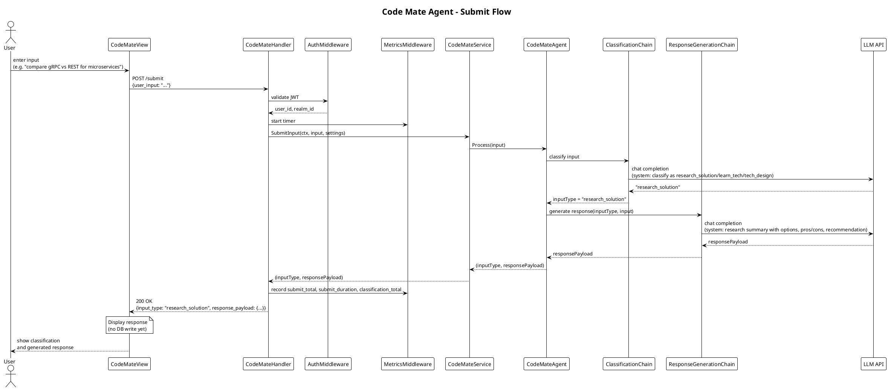
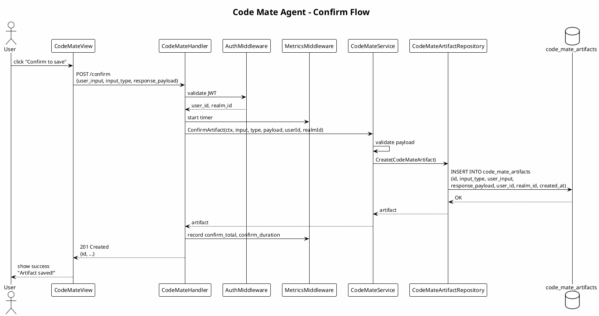

# Design: Code Mate Agent

## Context

The app already has chat, LLM integration (including LLM model selection), and in-memory session history. This change introduces a separate flow that (1) classifies user input as tech research, learn-tech, or tech-design intent, (2) generates a type-appropriate structured response, and (3) persists to the database only when the user confirms. Stakeholders are developers who want a dedicated assistant to research solutions, learn new tech, and draft tech designs—with optional persistence for later reference.

**Framework**: The AI agent (classification + response generation) SHALL be built with [Eino](https://github.com/cloudwego/eino), the LLM/AI application development framework in Go. Eino provides component abstractions (ChatModel, ChatTemplate), orchestration (Chain, Graph), and optional ADK (Agent Development Kit) patterns that align with Go conventions and simplify stream handling, type safety, and composition.

## Development Methodology

### TDD (Test-Driven Development)

This change follows **TDD**: tests are written **before** implementation code.

1. **Red**: Write failing tests that define expected behavior (unit tests for agent, API contract tests, acceptance tests).
2. **Green**: Implement the minimal code to make tests pass.
3. **Refactor**: Clean up code while keeping tests green.

**TDD artifacts**:
- `acceptance_tests.md` defines acceptance criteria as executable test cases.
- Unit tests for Eino agent (classification, response generation) with mocked ChatModel are written first; implementation follows.
- API handler tests (submit, confirm, list) are written first; handlers are implemented to satisfy them.

### MDD (Metrics-Driven Development)

This change follows **MDD**: success metrics are defined **upfront**, instrumented during implementation, and validated before release.

**Key metrics** (see Metrics section below):
- Latency (P50, P95, P99) for submit and confirm endpoints.
- Classification accuracy (% of inputs classified correctly, sampled or via user feedback).
- Confirm rate (% of submits that lead to a confirm).
- Error rate (% of requests returning 4xx/5xx).
- Artifacts created per user/day (adoption signal).

**MDD workflow**:
1. Define metrics and thresholds before implementation.
2. Instrument code (Prometheus counters/histograms, logs) during implementation.
3. Add dashboards/alerts (Grafana or equivalent).
4. Validate metrics meet thresholds before marking the change complete.

## Goals / Non-Goals

- **Goals**: Classify input (research_solution / learn_tech / tech_design); generate consistent, type-appropriate responses (research summary, learning path, design sketch); persist only on explicit confirm; reuse existing LLM and auth (user/realm); implement the agent using Eino ADK; provide memory management for session context and similar-input recall; implement a Code Mate History page for viewing/filtering/searching past artifacts; follow TDD and MDD.
- **Non-Goals**: Real-time collaboration on artifacts; full NLP classification without LLM; replacing existing Assistant/chat; infinite conversation memory (bounded by token limit).

---

## Memory Management

The agent uses a **three-tier memory architecture** to provide contextual awareness:

### 1. Session Memory (Short-Term)

- **Scope**: Current browser session / conversation window.
- **Purpose**: Track recent inputs and responses within the session so the agent can reference recent context (e.g. "refine that design" or "add more resources").
- **Implementation**: In-memory sliding window (`SessionMemoryStore`) holding last N messages (configurable, default 10).
- **Eino Integration**: Pass session messages as conversation history to the ChatModel via `schema.Message` slice.
- **Eviction**: FIFO when window is full; cleared on session end.

### 2. Similarity Memory (Recall)

- **Scope**: User's confirmed code-mate artifacts.
- **Purpose**: When the user submits input similar to a previously saved item, surface the existing artifact for review or extension.
- **Implementation**: On submit, query the artifacts table for the same user with similar `user_input` (fuzzy match or embedding similarity if available). Return top-K matches (default K=3) alongside the new response.
- **Eino Integration**: Use a `Retriever` component (or custom lambda) in the Chain to fetch similar artifacts before generating the response. The agent prompt can include "You previously saved: ..." for context.
- **Future Enhancement**: Use vector embeddings (e.g. Eino's `Embedding` + `Retriever` with pgvector) for semantic similarity.

### 3. Persistent Memory (Long-Term)

- **Scope**: All confirmed code-mate artifacts in the database.
- **Purpose**: Durable storage of research notes, learning plans, and design artifacts for review, search, and analytics.
- **Implementation**: Code-mate artifacts table. Queryable via API and Code Mate History page.
- **Retention**: Soft-delete; optional hard-delete after N days (configurable).

### Memory Flow Diagram

```
┌───────────────────────────────────────────────────────────────────────┐
│                         User Input                                    │
└───────────────────────────────────────────────────────────────────────┘
                                  │
                                  ▼
┌───────────────────────────────────────────────────────────────────────┐
│  1. Session Memory (in-memory)                                        │
│     - Add input to sliding window                                     │
│     - Retrieve recent N messages as conversation context              │
└───────────────────────────────────────────────────────────────────────┘
                                  │
                                  ▼
┌───────────────────────────────────────────────────────────────────────┐
│  2. Similarity Memory (DB query)                                      │
│     - Search artifacts for similar user_input                         │
│     - Return top-K matches for context                                │
└───────────────────────────────────────────────────────────────────────┘
                                  │
                                  ▼
┌───────────────────────────────────────────────────────────────────────┐
│  3. Eino Agent (ChatModelAgent / Chain)                               │
│     - Classify input (research_solution / learn_tech / tech_design)   │
│     - Generate response with context (session + similar artifacts)   │
└───────────────────────────────────────────────────────────────────────┘
                                  │
                                  ▼
┌───────────────────────────────────────────────────────────────────────┐
│  4. Response + Similar Artifacts returned to user                      │
│     - User reviews and optionally confirms                            │
│     - On confirm → Persistent Memory (DB insert)                       │
└───────────────────────────────────────────────────────────────────────┘
```

---

## Code Mate History Page

A dedicated **Code Mate History** view in the frontend allows users to browse, search, and manage their saved artifacts (research notes, learning plans, design docs).

### Features

| Feature | Description |
|---------|-------------|
| **List View** | Paginated list of artifacts with input, type, response summary, and timestamp. |
| **Type Filter** | Dropdown/tabs to filter by type (research_solution, learn_tech, tech_design, all). |
| **Search** | Text search on `user_input` and `response_payload` (server-side LIKE or full-text). |
| **Date Range** | Filter artifacts by created date (today, this week, this month, custom range). |
| **Detail View** | Click an artifact to expand/modal showing full response. |
| **Delete** | Soft-delete individual artifacts (with confirmation dialog). |
| **Export** | Export filtered artifacts as CSV or JSON (optional, future enhancement). |
| **Statistics** | Summary panel: total artifacts, by type, streak (days with at least one artifact). |

### UI Wireframe (Conceptual)

```
┌─────────────────────────────────────────────────────────────────────────┐
│  Code Mate History                                           [+ New]    │
├─────────────────────────────────────────────────────────────────────────┤
│  [All Types ▼]  [Search... 🔍]  [Date: This Month ▼]  [📊 Stats]        │
├─────────────────────────────────────────────────────────────────────────┤
│  ┌───────────────────────────────────────────────────────────────────┐  │
│  │ 🔬 research | "golang vs rust for CLI"  | 2026-02-11 14:32  [🗑️]   │  │
│  │             | Pros/cons, recommendations...                        │  │
│  ├───────────────────────────────────────────────────────────────────┤  │
│  │ 📚 learn_tech | "Learn WebAssembly"    | 2026-02-11 10:15  [🗑️]   │  │
│  │               | Intro, concepts, learning path...                   │  │
│  ├───────────────────────────────────────────────────────────────────┤  │
│  │ 📐 tech_design | "API for file sync"    | 2026-02-10 20:45  [🗑️]   │  │
│  │                | Problem, options, chosen approach...             │  │
│  └───────────────────────────────────────────────────────────────────┘  │
│                                                                         │
│  [< Prev]  Page 1 of 5  [Next >]                                        │
└─────────────────────────────────────────────────────────────────────────┘
```

### API Endpoints for History

| Method | Endpoint | Description |
|--------|----------|-------------|
| GET | `/api/v1/code-mate/list` | List artifacts with pagination, filtering, search. |
| GET | `/api/v1/code-mate/:id` | Get single artifact detail. |
| DELETE | `/api/v1/code-mate/:id` | Soft-delete an artifact. |
| GET | `/api/v1/code-mate/stats` | Get summary statistics. |

(Submit and confirm endpoints: `POST /api/v1/code-mate/submit`, `POST /api/v1/code-mate/confirm`.)

---

## Architecture Diagram

High-level component architecture for the Code Mate Agent with memory management.



---

## Response Types (Code Mate)

| Type | Purpose | Response shape (structured) |
|------|---------|-----------------------------|
| **research_solution** | Research tech options and recommendations | Summary, options (with pros/cons), trade-offs, recommendation, references. |
| **learn_tech** | Learn a new technology or topic | Introduction, key concepts, learning path (steps), recommended resources (docs, tutorials, courses), prerequisites, time estimate. |
| **tech_design** | Create a tech design for programming | Problem statement, approach options, chosen approach, components/APIs, risks and mitigations. |

Classification fallback: if intent is unclear, default to **research_solution** so the agent still produces a useful answer.

---

## Assets Integration (Rules, Commands, Skills)

The Code Mate Agent SHALL be able to use content from the **assets** folder to ground responses in project conventions and reusable knowledge.

### Source layout (default)

- **assets/rules/** — Cursor-style rules (`.mdc`, `.md`): common and language-specific (e.g. `common/`, `golang/`, `java/`, `python/`, `typescript/`). Define coding style, security, testing, patterns.
- **assets/commands/** — Command prompts (`.md`): e.g. code-review, tdd, plan, refactor. Reusable prompts for workflows.
- **assets/skills/** — One directory per skill; each has `SKILL.md` (and optionally `config.json`, scripts). Deep reference for tasks (e.g. `golang-patterns`, `python-testing`, `security-review`).

The assets path SHALL be configurable (e.g. config file or env; default relative to app root: `assets/`).

### Discovery and selection

- **List**: The system SHALL provide a way to list available assets (e.g. GET endpoint or internal API) so the UI or caller can show rules, commands, and skills by name/path and optional metadata (language, tags).
- **Selection**: On submit, the caller MAY pass optional parameters to include specific assets (e.g. `rules[]`, `commands[]`, `skills[]` by key or path). Alternatively or in addition, the system MAY auto-select assets by inferred language or topic (e.g. from user input or settings).
- **Limit**: Total injected content SHALL be bounded (e.g. by token budget or max character count) to avoid overflowing the LLM context; excess assets may be truncated or omitted.

### Injection into agent context

- When processing a submit request, if any assets are selected (by user or auto), the backend SHALL load the corresponding file contents from disk and append them to the agent’s context (e.g. as a dedicated system or user message block: “Use the following project rules, commands, and skills when answering: …”).
- The agent’s existing system prompt for classification and response generation remains; the assets block is additive context so answers align with project rules and skill guidance.

### API (optional)

- **GET /api/v1/code-mate/assets** (or `/assets/list`) — List available rules, commands, and skills (names, paths, optional language/tags). Auth required. Enables UI to offer asset selection.
- **POST /api/v1/code-mate/submit** — Request body MAY include optional fields such as `asset_rules[]`, `asset_commands[]`, `asset_skills[]` (list of keys/paths to include). If present, those assets are loaded and injected into context for that request.

---

## Sequence Diagram: Submit Flow

User submits input → classification + response generation → no persistence.



---

## Sequence Diagram: Confirm Flow

User confirms → persist to database.



---

## Decisions

1. **Eino ADK for the agent**: Use Eino ADK (`ChatModelAgent`) with custom Chains for the code-mate agent. The ADK provides conversation state management and cleaner abstraction for multi-step flows. Wire Eino's ChatModel to the existing LLM config (OpenAI-compatible endpoint + API key) so current model selection and credentials are reused.

2. **Input classification**: Use LLM with a short system prompt to classify input into one of: research_solution, learn_tech, tech_design. Fallback to "research_solution" if unclear. Implement as first Chain in the agent.

3. **Response shape**: One response payload per request. For research_solution: summary, options (pros/cons), trade-offs, recommendation. For learn_tech: intro, key concepts, learning path, resources, prerequisites, time estimate. For tech_design: problem statement, options, chosen approach, components/APIs, risks. Backend returns a structured object (JSON) so the frontend can render sections and store on confirm.

4. **Memory management**: Three-tier architecture (session memory, similarity memory, persistent artifacts). Session: in-memory sliding window. Similarity: query DB for similar `user_input` (fuzzy or future embedding). Persistent: code_mate_artifacts table; queryable via API and Code Mate History page.

5. **Persistence**: Single table `code_mate_artifacts` with columns: id, input_type, user_input, response_payload (JSON), user_id, realm_id, created_at, updated_at, deleted_at. Record created only when user clicks "Confirm to save". Soft-delete supported.

6. **API**: Six endpoints:
   - `POST /api/v1/code-mate/submit` → classification + response + similar artifacts (no DB write)
   - `POST /api/v1/code-mate/confirm` → insert artifact
   - `GET /api/v1/code-mate/list` → paginated list with filters (type, search, date range)
   - `GET /api/v1/code-mate/:id` → single artifact detail
   - `DELETE /api/v1/code-mate/:id` → soft-delete
   - `GET /api/v1/code-mate/stats` → summary statistics
   All require auth; realm/user from existing auth middleware.

7. **UI placement**: Two new views:
   - **CodeMateView**: Input field, response display, similar artifacts panel, confirm button. Accessible under "Tools" or as new top-level menu item (e.g. "Code Mate").
   - **CodeMateHistoryView**: Paginated list, type filter tabs, search bar, date range filter, detail modal, stats panel. Accessible under same menu.

8. **Frontend state**: Use Pinia store (`codeMateStore`) to manage session ID, submit/confirm loading, artifacts list with pagination, and filter state (type, search, date range).

9. **Assets (rules, commands, skills)**: The Code Mate Agent uses an **asset loader** that reads from a configurable path (default `assets/`). At submit time, optional asset keys (rules, commands, skills) are passed; the loader reads file contents and injects them into the agent context so the LLM can use project rules and skills when generating research/learn/design responses. List endpoint (e.g. GET /api/v1/code-mate/assets) allows the UI to discover and select assets. Context size is capped to stay within token budget.

## Risks / Trade-offs

- **LLM dependency for classification**: If LLM is slow or unavailable, the flow degrades; fallback to "research_solution" and still generate an answer so the user can save.
- **Storing response payload**: Storing full response (JSON) allows flexible display and search later; alternative of storing only references would require separate storage—deferred.

## Migration Plan

- **Rename existing table**: `learning_records` → `code_mate_artifacts` via a single migration (e.g. `ALTER TABLE learning_records RENAME TO code_mate_artifacts` where supported, or create new table + copy + drop old).
- **Migrate `input_type` values**: Map old values to new: word/sentence/question → `learn_tech` or `research_solution` (e.g. by heuristic or default to `research_solution`); idea → `tech_design`; topic → `learn_tech`. Update any application code that reads/writes input_type.
- No changes to other existing tables. No new tables beyond the rename.

## Metrics (MDD)

Define upfront; instrument during implementation; validate before release.

### Operational metrics

| Metric | Type | Labels | Description | Threshold |
|--------|------|--------|-------------|-----------|
| `code_mate_submit_total` | Counter | `status` (success/error), `input_type` | Total submit requests | — |
| `code_mate_submit_duration_seconds` | Histogram | `input_type` | Latency of submit (including LLM call) | P95 < 5s |
| `code_mate_confirm_total` | Counter | `status` (success/error) | Total confirm requests | — |
| `code_mate_confirm_duration_seconds` | Histogram | — | Latency of confirm (DB write) | P95 < 200ms |
| `code_mate_classification_total` | Counter | `input_type` | Count by classified type | — |
| `code_mate_error_total` | Counter | `endpoint`, `error_code` | Errors by endpoint and code | Error rate < 1% |

### Business / adoption metrics

| Metric | Type | Description | Threshold |
|--------|------|-------------|-----------|
| `code_mate_confirm_rate` | Gauge (computed) | Confirms / Submits over rolling window | > 30% (healthy engagement) |
| `code_mate_artifacts_per_user_day` | Gauge (computed) | Avg artifacts created per active user per day | Trend up or stable |
| `code_mate_classification_accuracy` | Gauge (sampled) | % of classifications rated correct (via user feedback or spot-check) | > 90% |

### Instrumentation plan

1. Use existing Prometheus client (`pkg/metrics`) to register counters and histograms.
2. Wrap submit handler to record `submit_total`, `submit_duration_seconds`, `classification_total`.
3. Wrap confirm handler to record `confirm_total`, `confirm_duration_seconds`.
4. Expose metrics at `/metrics` (already available).
5. Add Grafana dashboard with panels for latency, error rate, confirm rate.
6. Add alerts: P95 latency > threshold, error rate > 1%.

### Validation criteria (before release)

- [ ] All operational metrics are instrumented and visible in Prometheus/Grafana.
- [ ] P95 submit latency < 5s under load (10 concurrent users).
- [ ] P95 confirm latency < 200ms.
- [ ] Error rate < 1% in staging test run.
- [ ] Confirm rate > 30% in pilot/dogfood (if available).

## External Dependencies

- **[Eino](https://github.com/cloudwego/eino)** (Apache-2.0): LLM/AI application development framework in Go. Used for ChatModel, ChatTemplate, and Chain (or Graph) orchestration for the code-mate agent. Docs: https://www.cloudwego.io/docs/eino/

## Open Questions

- Optional: Support editing the generated response before confirm (e.g. refine design or resources). Can be added in a follow-up change.
- Optional: Add user feedback mechanism (thumbs up/down on classification) to compute classification accuracy metric.
