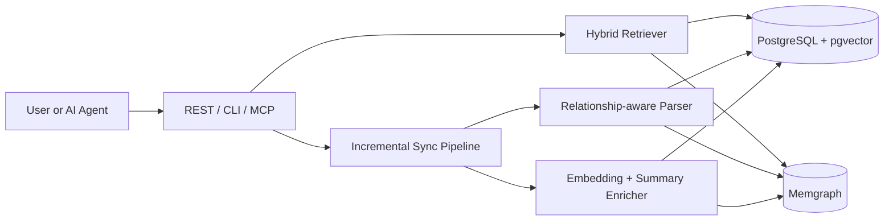

## Context

This change is the **full-feature follow-up** to `code-rag-kb-mvp`.

The MVP establishes:

- repository registration and async sync orchestration
- entity extraction via the existing `internal/rag/CodeParser`
- embedding-backed search with GORM persistence
- PKB-style knowledge documents (`repo-map`, `overview`)
- a web UI for verification

The remaining work is to evolve that thin slice into the complete Code RAG architecture described in `doc/code-rag-kb.md`.

The lazy-ai-coder project already provides strong building blocks:

- **`internal/rag/code_parser.go`**: Tree-sitter based parsing for multiple languages
- **`internal/rag/embedding_service.go`**: embedding client with batch helpers
- **`internal/llm/openai.go`**: chat wrapper used for answer generation
- **`internal/mcp/tools.go`**: MCP tool registration patterns
- **GORM + web stack**: existing service, route, and DB initialization patterns

## Goals / Non-Goals

**Goals**

- extend entity extraction into relationship-aware parsing
- move persistence from MVP-only GORM tables to production-grade vector + graph stores
- implement scalable hybrid retrieval across vector, graph, and text channels
- support incremental Git-based sync rather than full rebuild-only sync
- expose graph-aware capabilities via REST, CLI, and MCP for both humans and AI agents

**Non-Goals**

- replacing the MVP user flow; this change extends it
- building a general-purpose knowledge graph platform outside code repositories
- real-time file watching or IDE-save-triggered sync
- solving every PKB document type in this change; MVP docs remain the baseline and richer documents can be layered later

## Baseline Architecture

The MVP remains the entry point. This full change upgrades the internals behind it.

## Key Decisions

### D1: Build on MVP rather than replace it

**Decision**: Treat `code-rag-kb-mvp` as the prerequisite baseline and extend it incrementally.

**Rationale**: The MVP already proves the main user workflow and UI. Replacing it would create churn, duplicate effort, and make rollout riskier. The full feature set should upgrade storage, parsing depth, and retrieval quality behind the same top-level workflow.

### D2: Keep `internal/codekg/` as the boundary package

**Decision**: Continue using `internal/codekg/` as the feature boundary, with sub-packages for parser, stores, retriever, generator, and syncer.

**Rationale**: The MVP already established this package boundary. It keeps code-graph concerns isolated from the simpler document-RAG abstractions in `internal/rag/`.

### D3: Use pgvector + Memgraph as complementary stores

**Decision**: Use PostgreSQL + pgvector for durable vector and text retrieval, and Memgraph for traversal-heavy graph queries.

**Rationale**:

- `pgvector` gives durable ANN search, filtering, and text indexing
- Memgraph gives fast multi-hop traversal and relationship exploration
- together they map cleanly to the GraphRAG retrieval model from the design research

**Alternatives considered**

- pgvector only: simpler, but graph traversal becomes awkward and slow for deeper relationship queries
- Memgraph only: weak fit for durable vector + text retrieval
- SQLite-only continuation: acceptable for MVP, not for scalable hybrid retrieval

### D4: Use RRF for cross-channel ranking

**Decision**: Merge vector, graph, and full-text results with Reciprocal Rank Fusion (`k=60`).

**Rationale**: RRF avoids brittle score normalization across heterogeneous channels and is easy to reason about operationally.

### D5: Incremental sync is Git-diff based

**Decision**: The full feature set computes changes from `last_commit -> HEAD` and only reprocesses touched files.

**Rationale**: Full rebuilds are acceptable in MVP but too expensive as repositories and usage scale.

### D6: Preserve PKB docs as first-class outputs

**Decision**: Keep MVP PKB outputs (`repo-map`, `overview`) and treat them as stable public artifacts even after graph and vector capabilities are added.

**Rationale**: The PKB methodology remains valuable for onboarding and explainability. Advanced retrieval should enrich these artifacts, not replace them.

## End-to-End Flow

### Ingestion

1. Repository sync starts from the registered repo and previous synced commit.
2. Git diff determines added, modified, and deleted files.
3. Parser extracts entities and relationships from changed files.
4. Enricher generates embeddings and summaries as needed.
5. Vector store upserts entities/chunks.
6. Graph store upserts nodes/edges and removes stale entities.

### Query

1. User or agent submits a natural language query.
2. Intent analysis identifies entity names, keywords, and likely relationship intent.
3. Retriever runs vector, graph, and text channels in parallel.
4. Results are fused with RRF.
5. Seed entities are expanded through the graph and pruned for relevance.
6. Generator assembles graph context + code snippets into the LLM prompt.
7. API, CLI, or MCP returns the answer and structured references.

## Risks / Trade-offs

**Operational complexity**  
This change adds PostgreSQL extensions, Memgraph, background jobs, and more moving parts than the MVP.

**Store consistency**  
Dual-store systems can drift if writes partially fail. Sync needs idempotent upserts and recoverable failure handling.

**Embedding and summarization cost**  
Initial indexing and updates can become expensive on large repos. Rate limiting, batching, and selective summarization are required.

**Graph quality risk**  
Relationship extraction quality determines graph usefulness. Poor extraction would make graph expansion noisy and reduce trust.

## Relationship to PKB

The PKB methodology remains the documentation layer on top of the retrieval system:

- MVP documents (`repo-map`, `overview`) remain required outputs
- richer graph extraction enables future PKB documents such as architecture, workflows, and dependency explanations
- AI onboarding still follows the PKB staged model:
  - map the repository
  - understand key workflows
  - inspect module-level dependencies
